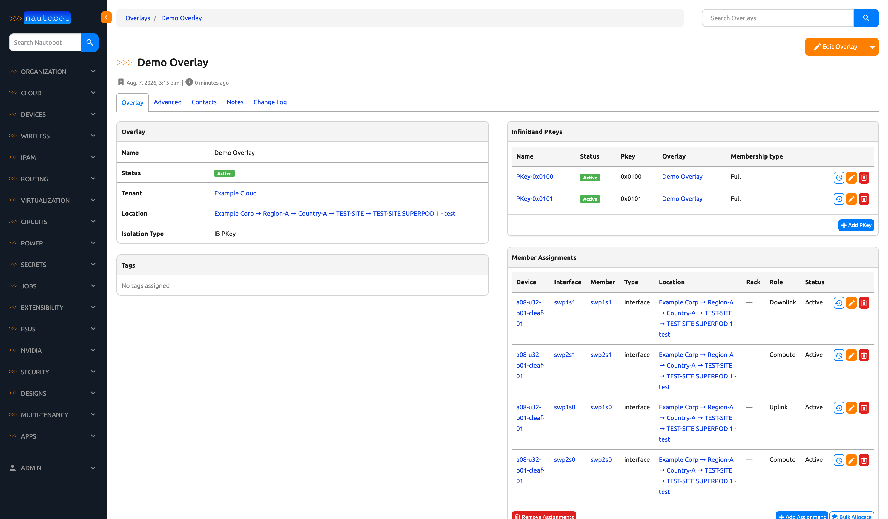
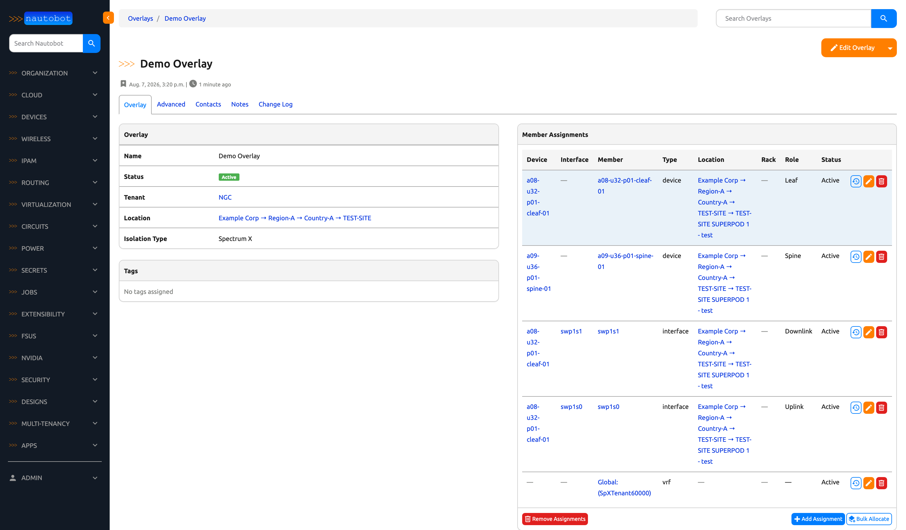

# Overlays

Overlays represent tenant network segments within a specific location.




## Model Fields

| Field | Type | Required | Description |
|-------|------|----------|-------------|
| Name | String | Yes | Unique name within the location |
| Tenant | ForeignKey | Yes | Owning tenant |
| Location | ForeignKey | Yes | Site/superpod location |
| Isolation Type | Choice | Yes | See [Isolation Types](#isolation-types) below |
| Status | Status | Yes | Active, Planned, etc. |
| Partition ID | Integer | No | Numeric ID used by NVLink Partition fabric controllers |

## Isolation Types

| Value | Display Name | Description |
|-------|-------------|-------------|
| `vxlan_evpn` | VXLAN/EVPN | Ethernet fabric isolation via VXLANs and BGP EVPN |
| `ib_pkey` | IB PKey | InfiniBand partition key isolation |
| `ib_mkey` | IB MKey | InfiniBand management key isolation |
| `nvlink_partition` | NVLink Partition | NVLink partitioning (uses `partition_id`) |
| `spectrum_x_vrf` | Spectrum X | Spectrum X isolation via VRF assignment |

### Associated Objects by Isolation Type

| Type | Associated Records | Assignment Object Types |
|------|--------------------|------------------------|
| **VXLAN/EVPN** | VXLAN VNIs; VRFs, VLANs, route targets  | Device, Interface, Rack |
| **IB PKey** | InfiniBand PKeys | Interface only (requires GUID) |
| **IB MKey** | InfiniBand MKeys | Interface only (requires GUID) |
| **NVLink Partition** | None | Device, Interface, Rack |
| **Spectrum X** | None | Device, Interface, Rack |

## Creating an Overlay

**Web UI:** Navigate to **Multi-Tenancy > Overlays > Add**

**REST API:**

```bash
curl -X POST "https://nautobot.example.com/api/plugins/overlays/overlays/" \
  -H "Authorization: Token $TOKEN" \
  -H "Content-Type: application/json" \
  -d '{
    "name": "superpod1-tenant-a",
    "tenant": {"name": "Tenant A"},
    "location": {"name": "Superpod-1"},
    "isolation_type": "vxlan_evpn",
    "status": {"name": "Active"}
  }'
```

## Overlay Assignments

Overlay Assignments associate resources with an overlay.



**Supported object types:** Device, Interface, Rack (varies by isolation type — see table above)

**Roles:** `uplink`, `downlink`, `compute`, `leaf`, `spine`, `storage`

### Assignment Fields by Isolation Type

| Field | VXLAN/EVPN | IB PKey | IB MKey | NVLink Partition | Spectrum X |
|-------|------------|---------|---------|-----------------|------------|
| Object Types | Device, Interface, Rack | Interface only | Interface only | Device, Interface, Rack | Device, Interface, Rack |
| GUID | Not used | Required | Required | Not used | Not used |
| Membership Type | Not used | Optional (full/limited) | Not used | Not used | Not used |

### IB PKey / IB MKey Assignments

For IB overlays, assignments must be Interfaces and require a GUID:

```bash
curl -X POST "https://nautobot.example.com/api/plugins/overlays/overlay-assignments/" \
  -H "Authorization: Token $TOKEN" \
  -H "Content-Type: application/json" \
  -d '{
    "overlay": {"name": "ib-overlay-1"},
    "assigned_object_type": "dcim.interface",
    "assigned_object_id": "uuid-of-interface",
    "guid": "0x0002c9030012abcd",
    "membership_type": "full",
    "status": {"name": "Active"}
  }'
```

## Deletion Behavior

When an overlay is deleted:

- **Overlay Assignments** — Automatically deleted (cascade)
- **VXLANs** — Preserved; `overlay` field set to null
- **InfiniBand PKeys** — Preserved; `overlay` field set to null
- **InfiniBand MKeys** — Preserved; `overlay` field set to null
