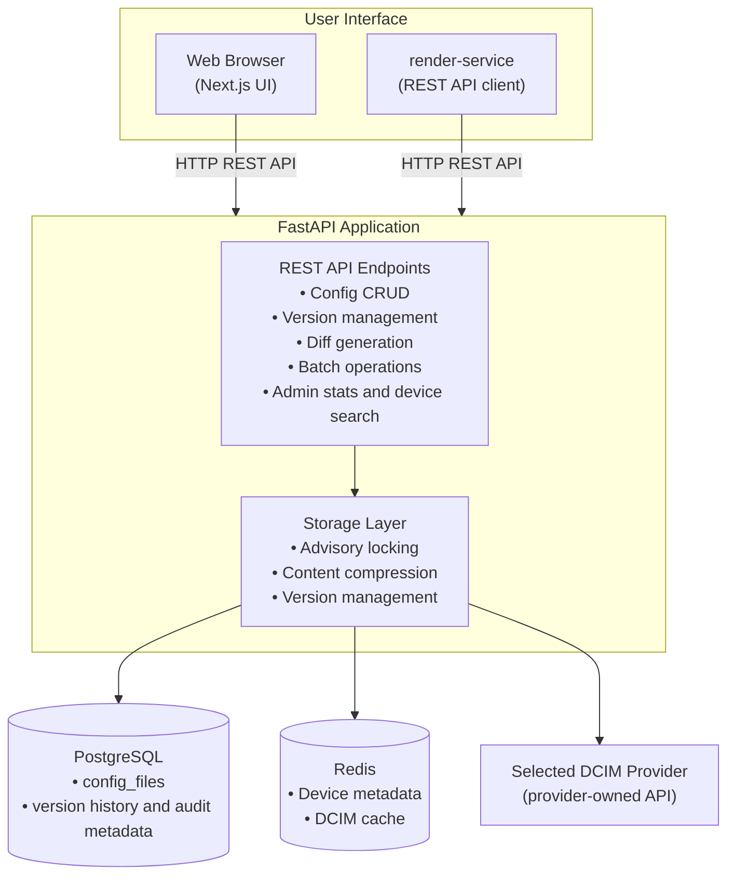
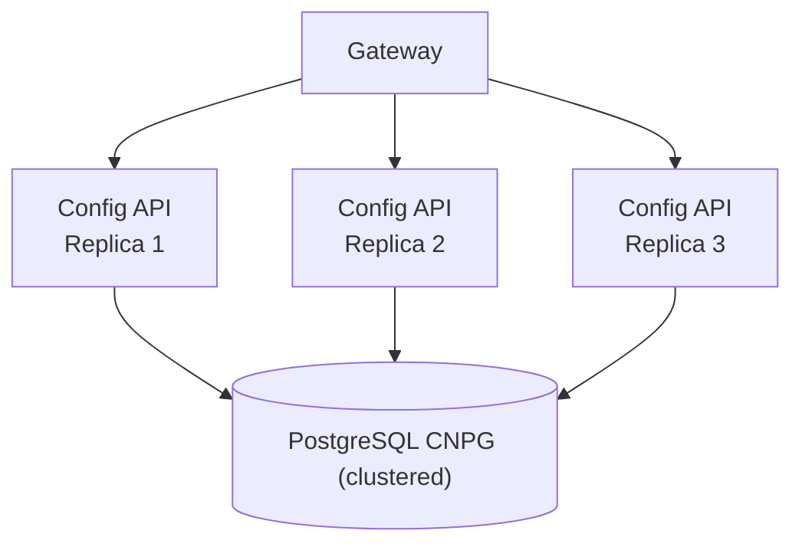

This document describes the system architecture of the NVIDIA Config Manager Config Store service.

## System Architecture



### Components

#### API Service (FastAPI)

The API service is a FastAPI application that provides a REST API for configuration management. It provides:

- Versioned configuration storage with 1-year retention
- Gzip compression (level 6) for storage efficiency
- PostgreSQL advisory locks for fine-grained concurrency control
- RESTful API with OpenAPI documentation
- Diff generation between versions
- Bulk operations and batch endpoints

#### Web UI

- Next.js web interface for browsing device configurations
- See [Web UI](index.mdx#web-ui) for features and access instructions

#### PostgreSQL (CNPG)

- Primary data store for versioned configs
- Advisory locks for concurrent writes
- Automatic versioning per device/filename/file_type
- Compressed content storage

#### Redis

- Cache for selected-provider device metadata
- Reduces load on the provider API

#### DCIM Provider

- Source of truth for normalized device metadata (site, platform, role, rack)
- Accessed through the provider SDK; the provider owns its native REST,
  GraphQL, or client-library calls
- Metadata cached in Redis for performance

## High Availability Architecture



In this high-availability architecture:

- Any API replica can handle any request
- If one replica crashes, others continue serving
- Fine-grained locking allows concurrent writes from all replicas
- No single point of failure (SPOF)

## Data Flows

### Write Operation Flow

1. Client sends HTTP POST request to API endpoint
1. FastAPI receives request and validates input
1. Storage layer acquires PostgreSQL advisory lock (device+filename+file_type)
1. Content is compressed using gzip (level 6)
1. Content hash is calculated for deduplication
1. New version is inserted into `config_files` table
1. Lock is automatically released on transaction commit
1. Response returned with version number

### Read Operation Flow

1. Client sends HTTP GET request to API endpoint
1. FastAPI queries PostgreSQL for latest version
1. Content is decompressed from storage
1. Device metadata is enriched from Redis cache (or the selected provider if cache miss)
1. Response returned with config content and metadata

### Concurrent Write Handling

- PostgreSQL advisory locks provide fine-grained locking at device+filename+file_type level
- Different devices can write simultaneously without blocking
- Intended and backup configs have independent locks
- Locks are automatically released on transaction commit/rollback
- Failed transactions release locks automatically

## Storage Architecture

### Database Schema

The `config_files` table stores all versioned configuration content:

```sql
config_files:
- id (UUID, primary key)
- device_uuid (text, indexed; provider-owned device identifier)
- filename (text)
- file_type (enum: intended|backup, indexed)
- version (integer)
- content (bytea, compressed)
- content_hash (text, SHA256 of uncompressed)
- author (text, indexed)
- commit_message (text)
- created_at (timestamp with timezone, indexed)

Unique constraint: (device_uuid, filename, file_type, version)
Indexes: device+filename, device+filename+file_type, created_at, author
```

### Compression

- Content is compressed using gzip level 6 before storage
- Typical compression ratio: ~93% reduction (50KB → ~5KB)
- Decompression happens on read operations
- Content hash is calculated on uncompressed content for deduplication

### Versioning

- Automatic version increment per device/filename/file_type combination
- Versions start at 1 and increment sequentially
- Each version is immutable (no updates, only new versions)
- Full audit trail with author, commit message, and timestamp

## DCIM Provider Integration

Device metadata is fetched through the selected provider and cached in Redis:

- Site information
- Platform details
- Device role
- Rack location
- Other device attributes

This metadata enriches API responses and enables device-centric views in the UI.

**Caching Strategy**:

- Metadata cached in Redis with TTL
- Cache misses trigger provider-owned API calls
- Cache refresh service periodically updates stale entries

## Deployment Architecture

### Kubernetes Deployment

The service is deployed as a Kubernetes application with:

- **API Service**: 3-5 replicas for high availability
- **PostgreSQL**: CNPG cluster (primary + 2 replicas)
- **Redis**: Shared service for DCIM metadata caching
- **Web UI**: Optional Next.js frontend
- **Gateway**: For external access

### Infrastructure Requirements

- **PostgreSQL**: CNPG cluster (primary + 2 replicas)
  - Memory: 16GB per instance
  - CPU: 4-8 cores per instance
  - Storage: 200GB SSD
- **Redis**: Shared service for DCIM metadata caching
- **API Replicas**: 3-5 replicas for high availability
  - Memory: 1GB per replica
  - CPU: 500m per replica

## Monitoring and Observability

### Prometheus Metrics

You can access Prometheus metrics at the operational `/metrics` endpoint. Config store provides the default set of metrics, as documented in the [Instrumentator documentation](https://github.com/trallnag/prometheus-fastapi-instrumentator):

- `http_requests_total` - Total number of requests
- `http_request_size_bytes` - Sum of the content lengths of all incoming requests
- `http_response_size_bytes` - Sum of the content lengths of all outgoing responses
- `http_request_duration_seconds` - Total duration of requests, limited to only a few buckets
- `http_request_duration_highr_seconds` - Higher resolution duration of requests, with a large number of buckets

### Health Checks

- **Health Check Route**: `GET /healthcheck`
- **Readiness Probe**: Database connectivity check
- **Liveness Probe**: Application responsiveness check

### Logging

- Structured logging with request IDs
- Audit logging for all configuration changes
- Error logging with stack traces
- Performance logging for slow operations
