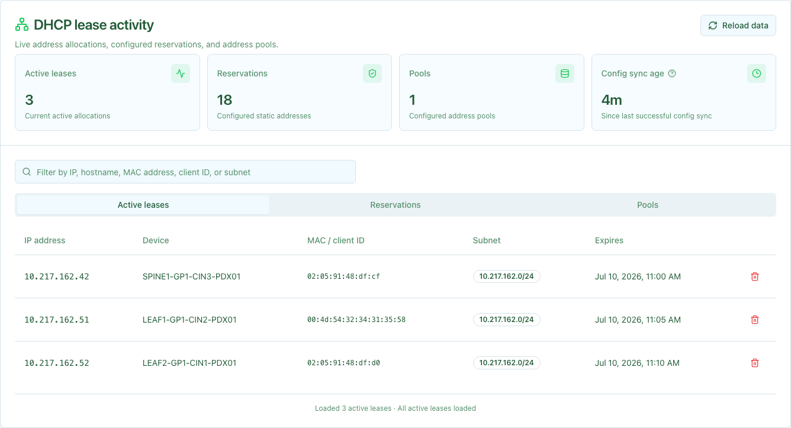

NVIDIA Config Manager's DHCP service generates and manages ISC Kea DHCP server
configurations from data supplied by the selected DCIM provider. The service
automates IP address assignment, DHCP reservations, and Zero Touch Provisioning
(ZTP) for network devices. The bundled Nautobot provider's data model is
documented separately.

## Overview

The DHCP service:

- Queries the selected DCIM provider for DHCP-relevant network data (prefixes, IP addresses, devices)
- Generates Kea DHCP4/DHCP6 configuration files with subnets, pools, and reservations
- Manages Kea server configuration updates through the Kea Control Agent API
- Supports ZTP integration with device-specific boot script URLs

Key features include:

- **Dynamic Configuration Generation**: Automatically generates Kea config from the selected DCIM source of truth
- **Static DHCP Reservations**: Device-specific IP assignments based on MAC address or serial number
- **Dynamic IP Pools**: Configurable ranges for transient device addressing
- **ZTP Integration**: DHCP options for automated device bootstrapping (boot scripts, firmware URLs)
- **Multi-Site Support**: Aggregate and site-local DHCP server deployments
- **IPv4 and IPv6**: Full support for both DHCP4 and DHCP6
- **Configuration Validation**: Validate configs against Kea Control Agent API before deployment

## Getting Started

For the bundled Nautobot provider, configure DHCP in Nautobot as follows:

Before you begin, make sure you understand the data model. Read [DHCP Modeling in Nautobot](nautobot-modeling.mdx) to learn about tagging network prefixes and IP addresses.

Follow the procedures on this page to define and generate your DHCP configuration.

### Set up Subnets and Gateways

1. Set up your prefixes. Tag network prefixes with `dhcp-subnet`.

1. Define gateway relationships. Create `prefix-to-gateway` relationships for each subnet.

### Set up Reservations and Pools

1. Configure reservations. Tag device IPs with `dhcp-reserve` for static assignments.

1. Define pools. Tag IP ranges with `dhcp-pool` for dynamic allocation.

### Set up DHCP and ZTP Options

1. Add config contexts. Provide DHCP options and ZTP URLs for devices.

### Generate the DHCP Configuration

1. Generate configuration. Run `nv-config-manager-dhcp-confgen` to create Kea configuration files.

## Architecture

The DHCP service consists of:

- **Configuration Generator** (`nv-config-manager-dhcp-confgen`): Queries the selected DCIM provider and generates Kea config files
- **Kea DHCP Server**: ISC Kea DHCP4/DHCP6 server instances
- **Kea Control Agent**: API for managing Kea configuration and leases
- **PostgreSQL Lease Database**: Shared lease storage for high availability
- **Redis Cache**: Stores previous configuration for subnet ID preservation

## CLI Usage

### Basic Configuration Generation

```bash
# Generate Kea DHCP4 configuration
uv run nv-config-manager-dhcp-confgen generate-kea-configuration --ini-file nv-config-manager.ini --ip-version 4

# Generate Kea DHCP6 configuration
uv run nv-config-manager-dhcp-confgen generate-kea-configuration --ini-file nv-config-manager.ini --ip-version 6
```

### Refresh Cached Configuration

```bash
# Generate, validate, and publish the DHCPv4 configuration to Redis
uv run nv-config-manager-dhcp-confgen refresh-kea-configuration --ini-file nv-config-manager.ini --ip-version 4

# Generate, validate, and publish the DHCPv6 configuration to Redis
uv run nv-config-manager-dhcp-confgen refresh-kea-configuration --ini-file nv-config-manager.ini --ip-version 6
```

### Getting Help

```bash
# Show all available commands
uv run nv-config-manager-dhcp-confgen --help

# Show help for a specific command
uv run nv-config-manager-dhcp-confgen generate-kea-configuration --help
```

### Advanced Options

```bash
# Generate configuration to a file
uv run nv-config-manager-dhcp-confgen generate-kea-configuration \
  --ini-file nv-config-manager.ini \
  --ip-version 4 \
  --output-file /etc/kea/kea-dhcp4.conf

# Generate configuration with debug tracebacks
uv run nv-config-manager-dhcp-confgen generate-kea-configuration \
  --ini-file nv-config-manager.ini \
  --ip-version 4 \
  --debug

# Validate generated configuration against Kea without publishing it to Redis
uv run nv-config-manager-dhcp-confgen refresh-kea-configuration \
  --ini-file nv-config-manager.ini \
  --ip-version 4 \
  --check
```

In Kubernetes, the refresh process generates and publishes desired configuration to Redis every five minutes. A sidecar in each Kea pod monitors Redis, applies changed configuration through the Kea Control Agent, and verifies the running configuration hash.

## Manage Leases

The DHCP dashboard summarizes active leases, reservations, configured pools,
and the age of the last successful background configuration sync reported by
the DHCP API's `/metrics` endpoint. A configuration age older than 10 minutes
appears yellow; an age older than 30 minutes appears red. A stale value can
indicate a problem with DHCP configuration generation. Use the configuration-age
tooltip and service logs to troubleshoot it. When `monitoring.grafanaUrl` is
configured, **View Grafana** opens the dashboard in a new tab.

Leases, reservations, and pools load 100 at a time as you scroll so the dashboard remains responsive with thousands of records. Summary counts are calculated independently from the detail rows loaded in the browser. Use the filter to search the selected collection by its displayed fields. Reservation and pool results show exact filtered totals. Select the **Active leases**, **Reservations**, or **Pools** tab to inspect each view. You can also clear an active lease after confirming the action.

**Reload data** re-fetches the latest dashboard API responses. It does not trigger a configuration sync or regenerate the Kea configuration.



Collection requests default `ip_version` to `4`; pass `ip_version=6` to select IPv6. Lease and reservation item requests infer the version from the address and also accept an optional matching `ip_version`.

List leases with a bounded collection request:

```bash
curl --fail-with-body --get "${DHCP_API_URL}/lease" \
  --header "Authorization: Bearer ${TOKEN}" \
  --data-urlencode "limit=100" \
  --data-urlencode "subnet=10.217.162.0/24"
```

The response contains a `leases` array and an opaque `next_cursor`. When `next_cursor` is not null, pass it unchanged in the next request together with the same filters. This also applies to the optional `search` parameter: each request scans a bounded chunk of the lease inventory, and following `next_cursor` continues the same search through the next chunk. The dashboard follows these cursors automatically as you scroll.

Reservations and configured pools use the same bounded query parameters:

```bash
curl --fail-with-body --get "${DHCP_API_URL}/reservation" \
  --header "Authorization: Bearer ${TOKEN}" \
  --data-urlencode "limit=100" \
  --data-urlencode "search=leaf" \
  --data-urlencode "subnet=10.217.162.0/24"

curl --fail-with-body --get "${DHCP_API_URL}/pool" \
  --header "Authorization: Bearer ${TOKEN}" \
  --data-urlencode "limit=100" \
  --data-urlencode "subnet=10.217.162.0/24"
```

These responses contain `reservations` or `pools`, an exact `total_count` for the current filter, and an opaque `next_cursor`. The optional `subnet` parameter on all three collection routes matches one exact configured prefix; records without a configured subnet do not match it. Pass the cursor unchanged with the same `ip_version`, `limit`, `search`, and `subnet` values to continue.

Look up the device holding a lease:

```bash
curl --fail-with-body --get "${DHCP_API_URL}/lease/7.245.196.5" \
  --header "Authorization: Bearer ${TOKEN}"
```

Look up a configured reservation by address:

```bash
curl --fail-with-body --get "${DHCP_API_URL}/reservation/7.245.196.5" \
  --header "Authorization: Bearer ${TOKEN}"
```

Delete a lease so the address can be reassigned:

```bash
curl --fail-with-body --request DELETE "${DHCP_API_URL}/lease/7.245.196.5" \
  --header "Authorization: Bearer ${TOKEN}"
```

Lease responses use the Config Manager schema and include subnet prefixes. A successful delete returns `204 No Content`; a missing lease returns `404 Not Found`.

## Related Documentation

- [DHCP Modeling in Nautobot](nautobot-modeling.mdx) - Detailed guide on tagging and config contexts
- [Network ZTP Service](../network-ztp/index.mdx) - Zero Touch Provisioning integration
- [Nautobot Getting Started](../nautobot/index.mdx) - Understanding Nautobot data model
- [API Reference](api:dhcp-api)
