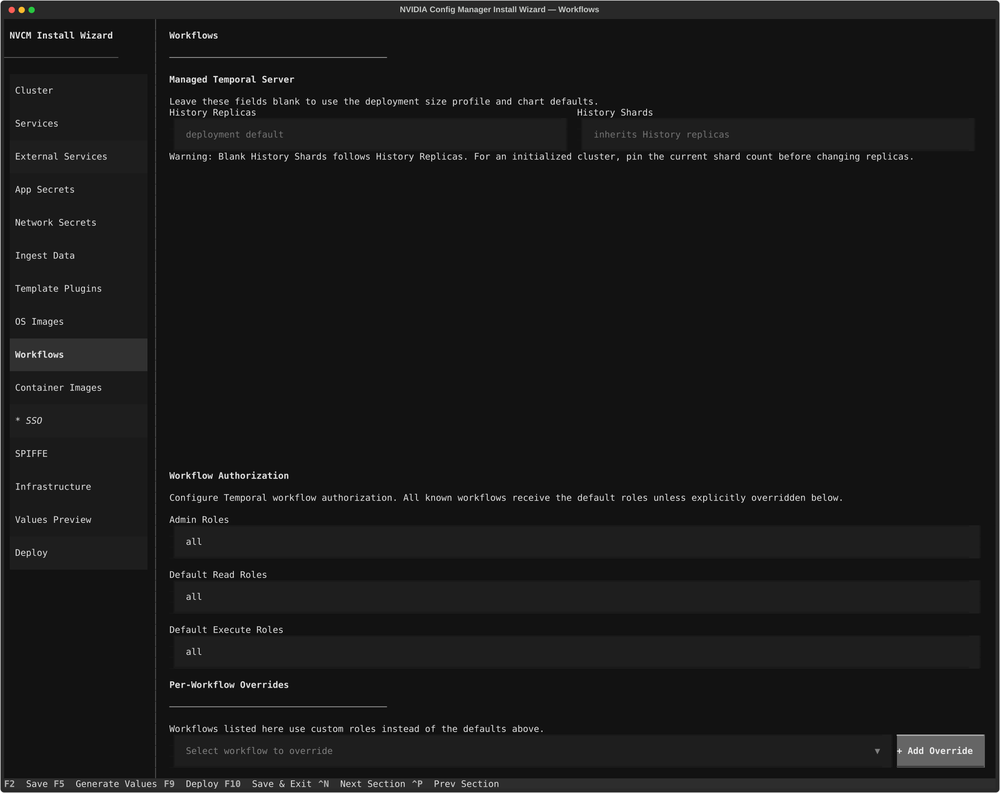
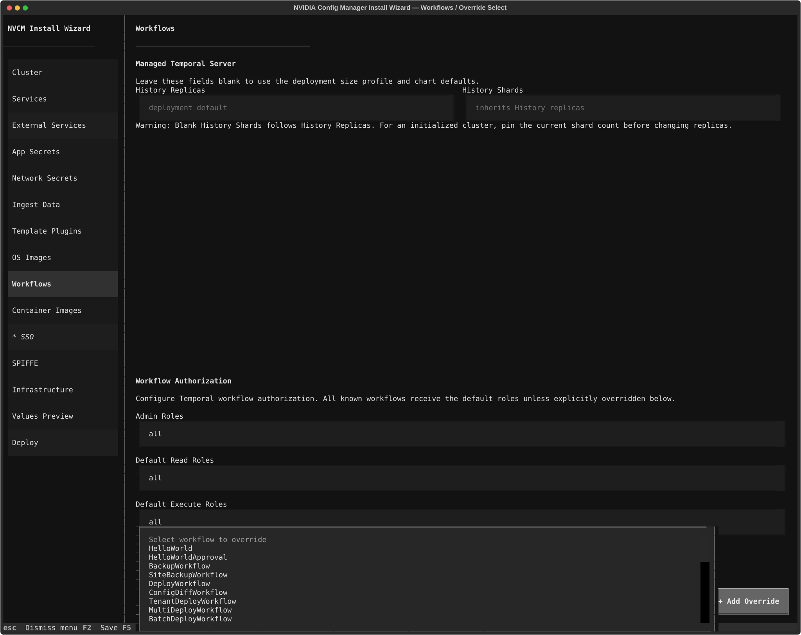

The textual user interface (TUI) wizard is organized by deployment concern. Work through the sections from top to bottom for a first-time install, or jump directly to the section you need when editing an existing `nv-config-manager-install.yaml`.

## Keyboard Shortcuts

| Key | Action |
| :-- | :----- |
| **F2** | Save configuration to disk |
| **F5** | Jump to Values Preview |
| **F9** | Jump to Deploy |
| **F10** | Save and exit |
| **Ctrl+C** | Quit after confirmation |
| **Ctrl+N** | Next section |
| **Ctrl+P** | Previous section |

Sidebar status indicators show which section is selected, complete, or needs attention. Hover over a section for status details.

## 1. Cluster

Set the deployment identity, site list, and resource size profile. These values drive service hostnames, namespace selection, Helm release naming, and generated resource overlays.

| Field | Description |
| :---- | :---------- |
| Hostname | Public DNS base domain for service endpoints, such as `nv-config-manager.example.com` |
| Environment | Environment label, such as `local`, `test`, or `prod` |
| Namespace | Kubernetes namespace for the deployment |
| Release Name | Helm release name |
| Airgapped Deployment | Enable airgapped mode |
| NVIDIA Config Manager Device Username | Device login username for the Config Manager service account |
| Size | Resource profile: `small`, `medium`, or `large` |
| Sites | List of sites managed by this deployment |

| Profile | Use Case | vCPU | RAM | Replicas |
| :------ | :------- | :--- | :-- | :------- |
| `small` | Local laptop or Kind | 8+ | 24 GB | 1 |
| `medium` | Remote VM or staging | 16+ | 64 GB | 1 |
| `large` | Production or HA | 96+ | 256 GB+ | 3+ |

Each size profile selects a matching Helm values overlay, such as `values-local-small.yaml`, that tunes CPU, memory, and replica counts across services.

Sites represent data centers managed by this Config Manager deployment. Each site name must match the slug of the corresponding Nautobot Location. Sites scope per-site network secrets such as device login credentials and BGP passwords.

## 2. Services

Choose which Config Manager services this deployment should run.

| Service | Description |
| :------ | :---------- |
| Render | Network configuration render service |
| ZTP | Zero Touch Provisioning |
| DHCP | DHCP server |
| Temporal | Temporal workflow engine |
| Config Store | Configuration storage API |

To use an existing Nautobot instance, configure it on the [External Services](#3-external-services) screen.

## 3. External Services

Connect Config Manager to a selected DCIM provider, Redis, Slack, or PostgreSQL services. Leave a service disabled to use the default in-cluster deployment.

| Service | Fields |
| :------ | :----- |
| DCIM provider | Provider name, use external DCIM, DCIM endpoint. The bundled provider is `nautobot-2x`; external providers require `services.nautobot: false`. |
| Redis | Use external Redis, host, port, TLS, password authentication |
| Slack | Configure a Slack channel for notifications |
| PostgreSQL | Use external PostgreSQL, port, Temporal host, Temporal Visibility host, Config Store host, DHCP host, Nautobot host |

An external provider is a separately packaged SDK implementation, not an
alternate service mode. Its wheel image belongs in `dcim.provider_packages`,
its name must match its Python entry point, and its non-secret settings belong
in `dcim.options`. See [Contribute a DCIM Provider](../development/contributing-dcim-provider.mdx)
for the provider-side contract.

## 4. App Secrets

Choose where application secrets are stored, and configure Git repository tokens for Nautobot Git sync.

| Field | Description |
| :---- | :---------- |
| Secrets Method | `kubernetes` for in-cluster secrets or `eso` for External Secrets Operator with Vault |
| Vault Server | Vault or OpenBao URL, shown when ESO is selected |
| Vault Namespace | Enterprise Vault namespace |
| Secrets Engine Mount Path | Vault secrets engine path |
| Config Secrets Engine Path | Optional separate path for config secrets |
| Vault Auth Method | `jwt` or `token` |
| JWT Auth Mount Path | JWT auth mount path |
| JWT Auth Role | JWT auth role name |
| Token Secret Name | Kubernetes secret name for token auth |
| Vault Secret Paths | Vault secret paths for ESO. Enable and customize only the groups you need. |

Vault paths map secret groups such as Nautobot, Redis, PostgreSQL, network credentials, OIDC, Redfish, BMC, Slack, Jira, and CNPG backup settings to the paths used in your Vault layout.

Git tokens create `git-token-<name>` Kubernetes secrets or ESO-backed Vault references for Nautobot Git sync.

<Note>
  If you are using local Kubernetes secrets, you can optionally supply manual values for each secret, or leave them blank to auto-generate a random secret.
</Note>

## 5. Network Secrets

Configure network protocol and workflow secrets written to `config-secrets.ini`. Common entries are pre-seeded on first run, including `hash_salt`, `bgp_password`, `root_password`, and `api_user_key`.

| Field | Description |
| :---- | :---------- |
| Name | Human-readable label |
| Secret Key | INI field name and Vault key when using ESO |
| Rotation | Rotation suffix |
| Value | Secret value; leave empty to auto-generate |

The **Scan Plugin Templates** button inspects Jinja2 templates from Content plugin paths to discover additional required secrets. Add template plugin locations on the [Template Plugins](#7-template-plugins) screen.

## 6. Ingest Data

Configure custom Nautobot jobs and post-deploy job execution. Bundled bootstrap jobs are always available from the Nautobot image. Use this section to stage a Design Builder topology loader or run other Nautobot jobs after Helm deployment.

| Field | Description |
| :---- | :---------- |
| Custom Nautobot Jobs | Paths to job directories or tarballs |
| Post-Deploy Jobs | Nautobot jobs to run after deployment, including class name and JSON input (local Nautobot only) |
| Jobs PVC Storage Class | Kubernetes storage class for the Nautobot jobs PVC |
| Jobs PVC Access Mode | `ReadWriteOnce` or `ReadWriteMany` |
| Node Selector | Node label selector for loader and Nautobot pods that mount the jobs PVC |

Custom and post-deploy jobs require local Nautobot (`services.nautobot: true`). If Nautobot is remote, configure and run those jobs directly on that instance.

For a concrete Design Builder example, see [Design Builder Data Loading](../nautobot/design-builder-data-loading.mdx).

## 7. Template Plugins

Configure Jinja2 template plugin directories used by the Render service. The node browser lets you pin plugin PVCs to a Kubernetes node on multi-node clusters that do not have shared RWX storage.

| Field | Description |
| :---- | :---------- |
| Template Plugins | Paths to template plugin directories |
| Plugin PVC Storage Class | Kubernetes storage class for the plugin PVC |
| Plugin PVC Access Mode | `ReadWriteOnce` or `ReadWriteMany` |
| Node Selector | `key=value` labels that pin the plugin PVC to a node |

If a PVC is `ReadWriteOnce`, it can only mount on the node where it was first bound. Pin the pod to that node on multi-node clusters without shared NFS or RWX storage.

## 8. OS Images

Configure where ZTP OS images are stored and which images should be uploaded during deployment.

| Field | Description |
| :--- | :---------- |
| File | Images are stored in a PersistentVolumeClaim with a `manifest.json` |
| S3 Bucket | Name of the S3 or Ceph bucket to use for image storage; no PVC is required |

For S3 bucket storage, configure the bucket name and path prefix. The installer computes SHA256 checksums, creates the expected `{platform}/{version}/{filename}` directory structure, and uploads the images to the S3 bucket.

| Field | Description |
| :---- | :---------- |
| PVC Name | Name for the images PVC |
| PVC Size | Storage request |
| Storage Class | Kubernetes storage class |
| PVC Access Mode | `ReadWriteOnce` or `ReadWriteMany` |
| OS Images | Images to upload at deploy time, including platform, version, and file path |
| Node Selector | Node label selector for the ZTP pod that mounts the PVC |

For file storage, configure the PVC name, size, storage class, access mode, and images to upload at deploy time. Each OS image entry includes platform, version, and local file path. During deployment, the installer computes SHA256 checksums, creates the expected `{platform}/{version}/{filename}` directory structure, and writes `manifest.json` to the PVC root. Images can also be uploaded later through the ZTP `/v1/files` API.

If a PVC is `ReadWriteOnce`, it can only mount on the node where it was first bound. Pin the pod to that node on multi-node clusters without shared NFS or RWX storage.

## 9. Workflows

Configure the managed Temporal server and workflow RBAC defaults and overrides.

| Field | Description |
| :---- | :---------- |
| History Replicas | Optional History service pod count. Leave blank to use the deployment size profile and chart default. |
| History Shards | Optional persisted History shard count. Leave blank to derive it from the History replica count. |
| Admin Roles | Roles with full admin access to all workflows |
| Default Read Roles | Default read access for all workflows |
| Default Execute Roles | Default execute access for all workflows |
| Per-Workflow Overrides | Override read or execute roles for specific workflows |

The workflow list is generated from the Helm RBAC values file.

<Warning>
Blank History Shards follows History Replicas. After Temporal has initialized
its database, confirm and pin the persisted shard count before changing
replicas. Temporal ignores shard-count changes after the first run; changing
the persisted count requires migration to a separate Temporal cluster.
</Warning>

## 10. Container Images

Configure image source and registry settings.

| Field | Description |
| :---- | :---------- |
| Image Source | `Build locally` or `Pull from registry` |
| Registry Prefix | Image registry prefix, such as `nvcr.io/nvidian/cfa` |
| Registry Key | Optional registry credentials |
| Tag | Default image tag |
| Pull Policy | Kubernetes pull policy |
| Per-Image Overrides | Override repository or tag for specific images |

When **Pull from registry** is selected, the installer can fetch available tags from the Docker V2 API.

Per-image overrides can set a custom repository or tag for individual components. For local builds, images are tagged with a short content hash derived from the Docker image ID. Helm only restarts pods when image content changes.

## 11. SSO

Configure OIDC Single Sign-On for Config Manager services.

| Field | Description |
| :---- | :---------- |
| Enable SSO | Main toggle |
| Provider | OIDC provider. The bundled sample uses `keycloak`; any compatible OIDC provider can be substituted. |
| Issuer URL | OIDC issuer URL |
| Client ID | OIDC client identifier |
| CLI Client ID | Optional public/native client identifier for CLI PKCE auth. Defaults to Client ID when unset. |
| Client Secret | OIDC client secret |
| JWKS URI | Override for JWKS endpoint |
| Audiences | Comma-separated audience list |
| Scopes | Comma-separated scope list |
| Additional JWT Providers | Add additional JWT issuers, such as SPIRE or external service accounts |

The configuration samples use Keycloak as the example OIDC provider, but the installer accepts any OIDC provider that supplies the required issuer, client, secret, JWKS, audience, and scope settings.

## 12. SPIFFE

Configure SPIFFE identity for service-to-service authentication.

| Field | Description |
| :---- | :---------- |
| Enable SPIFFE | Main toggle |
| Provider | `SPIRE` uses the CSI driver, and `Teleport` uses a machine ID |
| Auth Mode | `JWT-SVID` or `mTLS` |
| Trust Domain | SPIFFE trust domain |
| Socket Mount Path | Volume mount path in pods |
| Socket File | Agent socket filename |
| Socket Host Path | Host socket path for Teleport |
| Group Prefix Mappings | Maps SPIFFE ID prefixes to authorization groups. Use "Auto-generate Default" to populate from the current namespace. |

## 13. Infrastructure

Configure gateway behavior, TLS, database backups, monitoring resources, and load balancers.

| Field | Description |
| :---- | :---------- |
| Create GatewayClass | Create the cluster-scoped `envoy-gateway` GatewayClass. Disable when a shared Envoy Gateway installation already owns it. |
| Enable TLS | Use self-signed TLS certificates for public endpoints |
| CNPG S3 Backup | CloudNativePG PostgreSQL backups to S3 |
| Monitoring | PodMonitors and monitoring resources |
| Prometheus namespace | Namespace allowed through network policy for Prometheus scraping (defaults to `monitoring`) |
| Enable local observability stack | Enable Grafana and Loki for local development |
| Enable local Redis metrics exporter | Export metrics from bundled Redis; disabled when external Redis is configured |

The Redis metrics switch stores only the explicit preference to enable the metrics exporter on the bundled Redis instance.
Turning on local monitoring automatically enables both the Redis metrics exporter and the Redis PodMonitor without changing that preference.
Turning off local monitoring causes the Redis metrics exporter to be installed without creating a Redis PodMonitor.
Using external Redis suppresses both the Redis metrics exporter and the Redis PodMonitor.

Load balancer providers include None, MetalLB, Cilium, and AWS NLB. MetalLB and Cilium use static IPs and optional DNS names for ZTP and DHCP. AWS NLB can be configured separately for Gateway, ZTP, and DHCP.

<Info>
  For local or lab deployments using self-signed TLS, the browser and any API clients must trust the generated certificate authority or explicitly accept the warning for each service hostname.
</Info>

## 14. Values Preview

Generate and inspect the complete Helm values YAML before deploying. Use this screen to review exactly what the installer will pass to Helm.

| Button | Action |
| :----- | :----- |
| Generate | Build values from the current configuration |
| Write to File | Save generated values to the configured output path |

## 15. Deploy

Run deployment orchestration with live monitoring.

| Option | Description |
| :----- | :---------- |
| Build Images | Build Docker images locally |
| Load to Kind | Load built images into a Kind cluster |
| Install Envoy Gateway | Install Gateway API CRDs and Envoy Gateway |
| Install cert-manager | Install cert-manager CRDs and Helm chart |
| Install CNPG operator | Install CloudNativePG operator |
| Kind Cluster name | Kind cluster name |
| Helm Timeout | Helm install or upgrade timeout |
| Recreate existing secrets | Force-recreate Kubernetes secrets |
| Run integration tests | Run integration tests after deployment |

Once you have set up your configuration, click the **Start Deployment** button to begin the deployment process. The deploy screen shows a step list, live pod status, deployment logs, individual pod/container log streams, and integration test output.

If anything goes wrong, correct the error and click the **Retry Deployment** button to try again.

