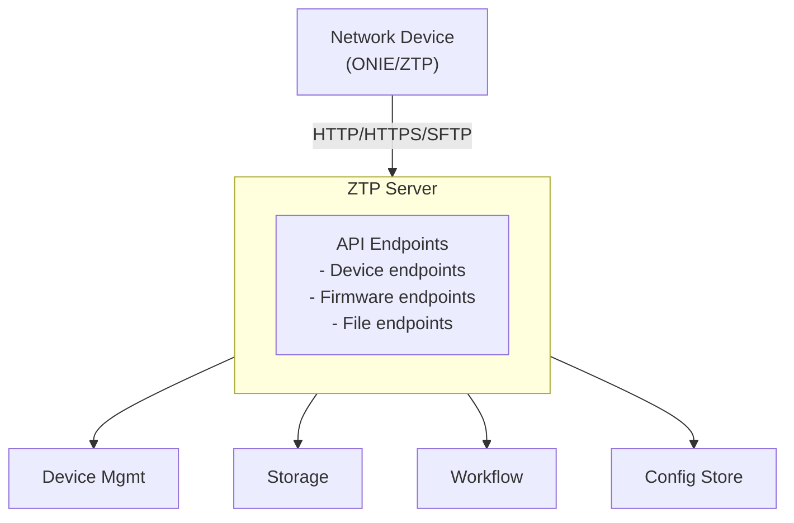

## Overview

The NVIDIA Config Manager ZTP Server facilitates Zero Touch Provisioning (ZTP) for network devices. It serves boot scripts, rendered configurations, and firmware images during the device provisioning process.

## System Architecture



## API Endpoints

The API is organized into three main endpoint groups:

- **Device Endpoints**: Device-specific operations for boot scripts, configurations, firmware, and provisioning status
- **Firmware Endpoints**: Platform/version-based firmware access
- **File Endpoints**: Generic file storage and retrieval operations

## Authorization Flow

### Device Endpoint Authorization

Device-specific endpoints authorize requests in one of two ways:

1. Device-originated requests must come from an IP address associated with the device in the device management system
1. User-originated requests must come through the Envoy gateway as an authenticated user when SSO is enabled for the deployment
1. Unauthorized requests receive a 403 Forbidden response

### Admin Endpoint Authorization

Admin endpoints (file uploads, sync triggers) require an authenticated user request through the Envoy gateway when SSO is enabled for the deployment.

## Provisioning Workflow

The typical ZTP workflow follows these steps:

```text maxLines=0
Device Boots
    │
    ├─→ DHCP Provides Boot File URL
    │
    ├─→ Device Requests Boot Script
    │   └─→ GET /v1/device/{uuid}/boot-script
    │
    ├─→ Device Downloads Firmware
    │   └─→ GET /v1/device/{uuid}/firmware
    │
    ├─→ Cumulus Device Loads Configuration over SFTP
    │   └─→ /device/{uuid}/startup.yaml
    │
    ├─→ Device Validates Serial
    │   └─→ POST /v1/device/{uuid}/validate_serial
    │
    ├─→ Device Marks Provisioned
    │   └─→ POST /v1/device/{uuid}/provisioned
    │       │
    │       ├─→ Update Device Status
    │       │
    │       └─→ Trigger Backup Workflow
    │
    └─→ Provisioning Complete
```

## Storage

The system uses object storage for firmware and file storage:

- Files are organized by platform and version
- Firmware images are tagged for identification
- Files include SHA256 checksums for verification
- Large files are streamed efficiently

## Security

### Authentication & Authorization

- Device endpoint authorization allows registered devices by source IP and authenticated users through the Envoy gateway when SSO is enabled
- Admin endpoints require an authenticated user through the Envoy gateway when SSO is enabled
- Serial number validation prevents unauthorized provisioning

### Data Protection

- Sensitive configuration files are only accessible to registered devices or authenticated users
- The default Cumulus template transfers rendered configuration over encrypted,
  source-IP-authorized SFTP and stages it mode `0600`
- Firmware images are served with checksums for verification

## Monitoring & Metrics

The system exposes Prometheus metrics at `/metrics`:

- Device request metrics with labels for client IP, base URL, and device UUID
- Standard HTTP metrics (request duration, count, status codes)

## Error Handling

The API uses standard HTTP status codes:

- `400 Bad Request`: Invalid request parameters or body
- `403 Forbidden`: Authorization failure
- `404 Not Found`: Resource not found
- `500 Internal Server Error`: Server error

Error responses include detailed error messages to help diagnose issues.
